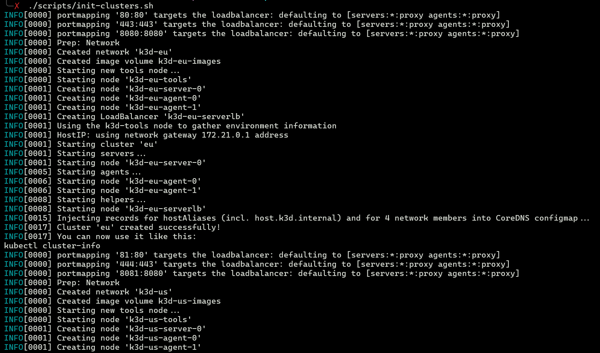
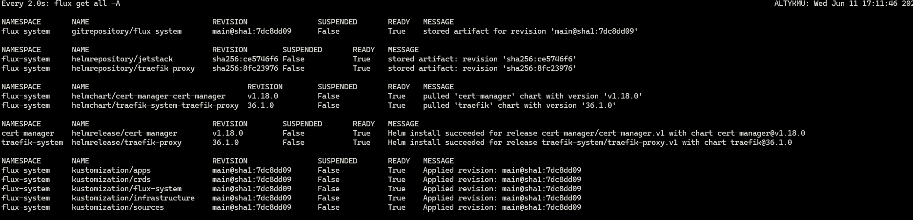
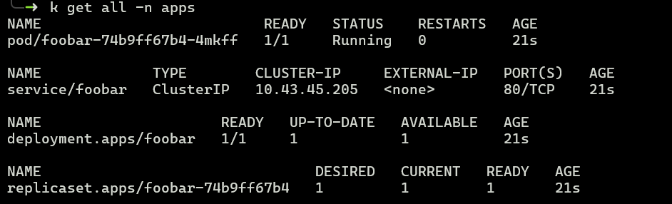
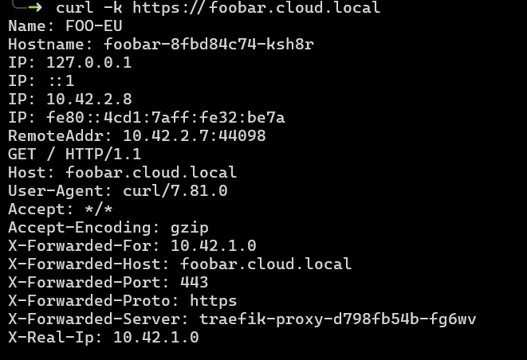
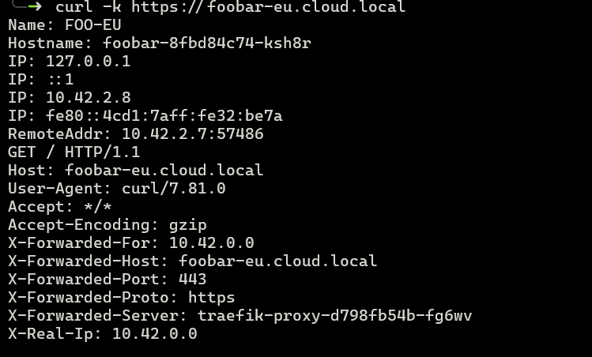
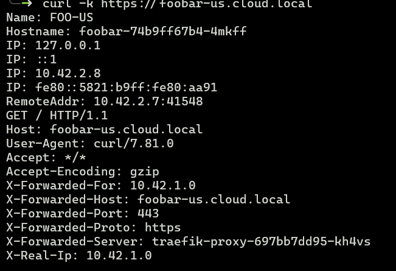
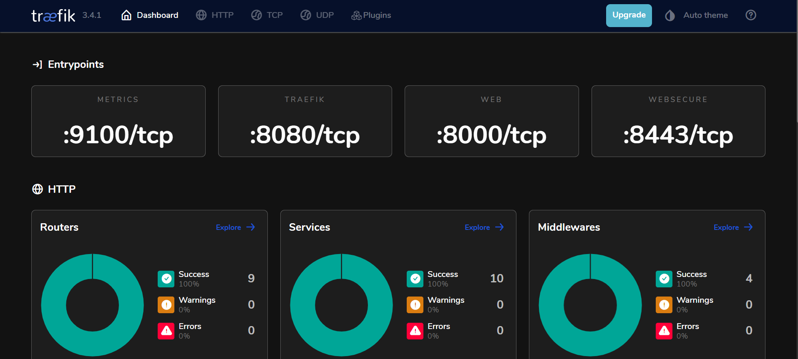
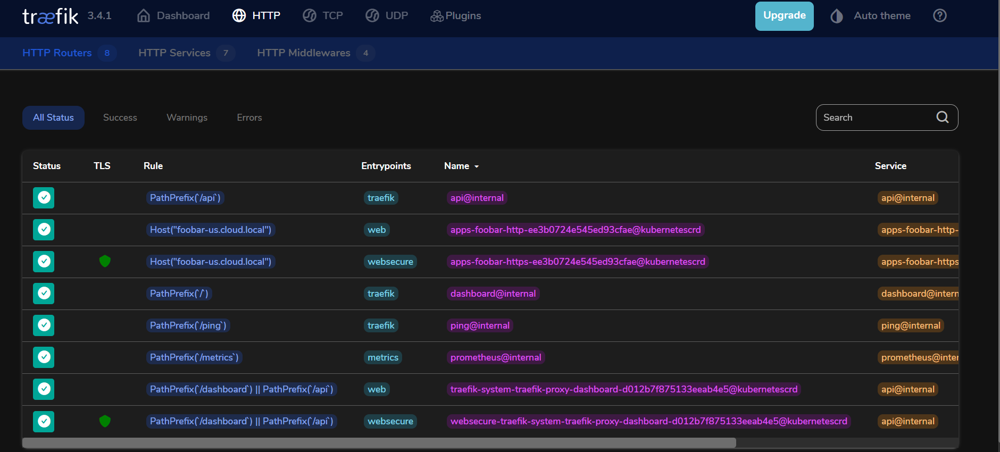

# Examples

This file contains some illustrated examples of calling an app API.

<code>./scripts/init-clusters.sh</code> - starting local clusters

<code>flux get all -A</code> on EU cluster

<code>k get all -n apps</code> on US cluster

See the `foobar` deployment.

<code>curl -k https://foobar.cloud.local</code>

This endpoint should load balance between EU and US.
Right now, it doesn't for technical reasons. (DNS and network issues)

<code>curl -k https://foobar-eu.cloud.local</code>

This endpoint only returns EU responses.

<code>curl -k https://foobar-us.cloud.local</code>

This endpoint only returns US responses.

Visit <a href="https://localhost/dashboard/">https://localhost/dashboard/</a> or <a href="https://localhost:444/dashboard/">https://localhost:444/dashboard/</a>

EU Dashboard

US Dashboard:

